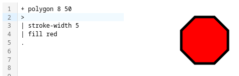

# Pinch
This is an experimental stack-based programming language for procedurally creating vector graphics.

 

## About
It compiles code into vector images. 

It's a programming language designed to feel a bit like a markup language, oriented around pipelines operations and a stack.

It allows you to describe images's as a series of visualizable and investigatable steps. 

It's called pinch because it's small. When discussing the project with a friend, they were talking about all of the features that could be added. I held up my thumb and forefinger in a pinch gesture as I explained "No, that's great but no. Scope down!"

## Why?
This is a design research project. My goal is not to "finish", although I am pleased with the prototype so far. There are a few questions/design spaces I hope to explore:

- **[Project Goal]** Are pipeline programming suitable for image creation. Does this way of problam solving adapt well to destructuring and composing graphics? 
- **[Programming Design]** How can we write structures normally found in node-based environments (Blender GeoNodes, MaxMSP, vvv, ShaderGraph, etc) in plaintext programming? (I want node tools, but produce standalone plaintext that I use my keyboard to interface with)
- **[Simple but not Easy]** I want to prioritize "this is easy to use once you know it" over "this is easy to learn". For now, at least, during the design phase. It is important for a language to be easy to learn, but I want to free myself of the constraint while exploring the design and functionality. 
- **[Self Explanatory]** "Easy" programming languages are often considered easy because of similarities to existing languages (like C. or, say, the english language). This gives users an onboarding ramp. I want to intentionally discard "familiarity" as a heuristic towards ease. This is a design exercise to enable me to hopefully discover other models and methods that make something "easy". I am inspired by visual/node languages, and I want to create a language that is visually informative of it's own structure and processes. Or, strive for that, at least.
- **[User Design]** Provide intuitive way to think about graphics creation. "Take these, align them, put them over there. These boxes should be the same size". One input does one thing, and we're not fiddling with transform handles or begging the snapping to work *just right*. 

    > Ian Henry describes the joy of this approach to problem solving in their blog post on [building bauble](https://ianthehenry.com/posts/bauble/building-bauble/)

Further, my intended use cases:

- I want to write presentations, slides, diagrams, etc in context-free and nondestructive ways. Write once, render in a staticly generated site, embed in powerpoint, keynote, use with obsidian, etc. Ideally in a vector format like SVG.
- Small diagrams without real-life scale (e.g. *not* CAD)
- I don't want to learn LaTeX?

## Related & Inspiration
- [OpenSCAD](https://openscad.org/)
- [Bauble](https://bauble.studio/)
- [Penrose](https://penrose.cs.cmu.edu/)
- Creative Coding Frameworks ([Processing](https://processing.org/), [p5](https://p5js.org/), [openFrameworks](https://openframeworks.cc/), etc)
- Shaders ([Shadertoy](https://www.shadertoy.com/), [kodelife](https://hexler.net/kodelife), [shaderplace](https://shader.place/))
- JS canvas/drawing Libraries ([fabricjs](https://fabricjs.com/), [threejs](https://threejs.org/), [paperjs](http://paperjs.org/), [g.js](https://g.js.org/), [konva](https://konvajs.org/))
- [Shelly.dev](https://shelly.dev/)

## Core Concepts

### Syntax Notes
Syntactically, every line begins with an operator. Looking down the lefthand column of the code, you will see a symbol telling you what that line is doing, and revealing a sense of the structure of the code.

Most commands have two identifiers, a shorthand and longhand. (e.g. "ifz"/"if-zero", "sw"/"stroke-width") Choose what you prefer, easier to read or easier to write.

#### Inline JS
Pinch is currently missing a lot of fundamental concepts, like "adding numbers" or "booleans".
I plan to add these features eventually, but in the meantime the single quote (') is a "raw javascript" literal, and it is useful for doing, for example, inline math.

```
{ repeat @i -20 20 10
    + circle >
    | x i

    { ifz 'i%20'
    | fill red
    }

    .
}

```


### The Stack
The > is the "push" operator. It put's what is on it's left on the "stack". The . (period) is the "pop" operator, it removes the topmost thing from the stack.

> The bottom of the stack, by default and un-poppable, is a root "group" element. Applying transformations (| fill red) to the root is the same as adding it to any other group: it will set it's children so long as they don't have the same property set. Basically, you can apply default styles by styling the root.

### Stack Operations
[op] [identifier] [space-separated parameters]

|, +, # and ~ are stack operators. They do something to whatever is currently on the top of the stack. 

- \+ (append) adds it's argument as a child to the one on the stack. Usually it's adding an item to a group.
- | (pipe) is a transformation, it changes some attribute of the object on the top of the stack.
- ~ (tilde) is a conversion. It alters (type casting/converting) the object on the stack, or otherwise significantly changes the object on the stack. It only affects the topmost object.
- . (dot) is a pop operator. Alone, it simply pops. If an identifier follows one or more dots, it will pop 1 or more objects and do something with them. e.g ..subtract or .append
> If you don't include an operator, but you're on the root of the stack (the base canvas) it will append for convenience. The '+' symbol is always recommended anyway for clarity.
- \# is for 'Environment Properties'. These may be overridden by the renderer. Most common is setting the canvas width/height or other document metadata. That sort of thing.

### Flow Operations
[{] [identifier] [space-seperated parameters] [newline] [list of statements] [}]

Stack operations are a symbol followed by an identifier. 

Flow operators all start with a { symbol, then their call on the same line. The rest of the lines are contained in a block, followed by a }.

> The { is on the outside like with Lisp, but using curlies like C. So everyone is unhappy! (Wait, don't leave yet. It's alright. Remember, the left column of the code is a scannable set of operator symbols)

The @ symbol names a local variable within a flow operation. Repeat takes an optional named variable which can then be looked up (without the @)

```
{ repeat @i -20 20 10
    + circle >
    | x i
    .
}

{ def itemname
+ circle 20
}
```

---
#### Attribution
[SVG](https://tabler.io/icons/icon/file-type-svg), [PNG](https://tabler.io/icons/icon/file-type-png), [mood-smile](https://tabler.io/icons/icon/mood-smile), and [mood-sad-squint](https://tabler.io/icons/icon/mood-sad-squint) icons by [Tabler](https://tabler.io/icons) icons. [MIT License](https://tabler.io/license).